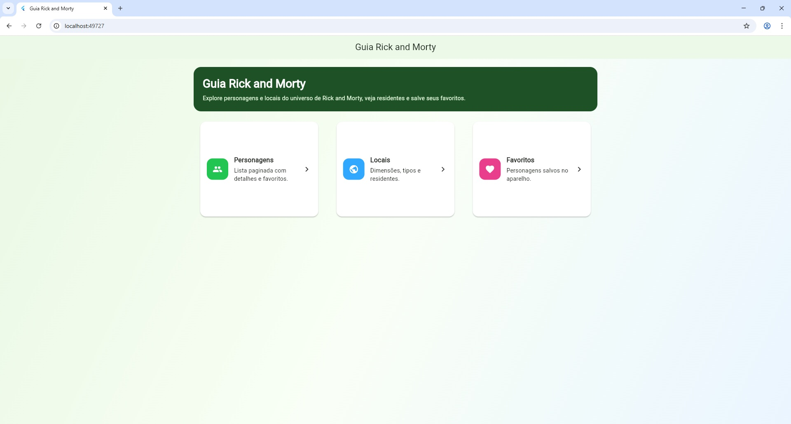
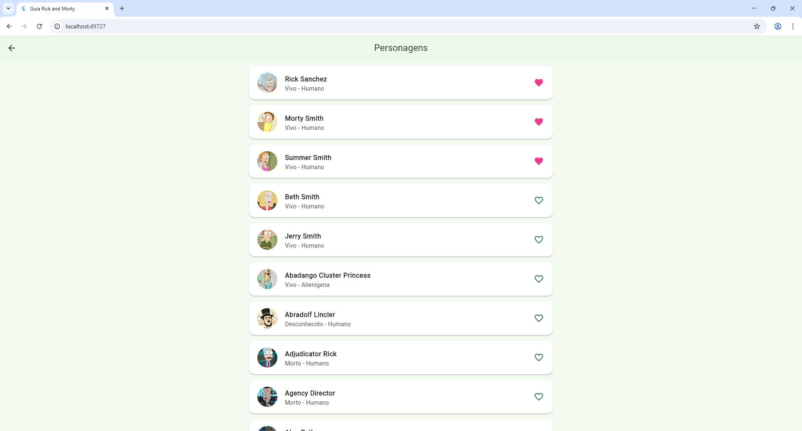
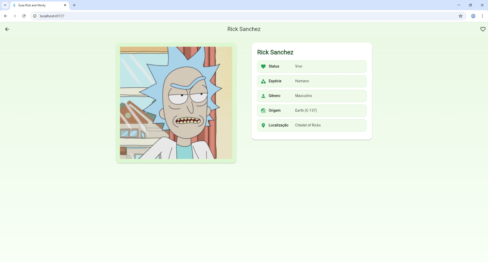
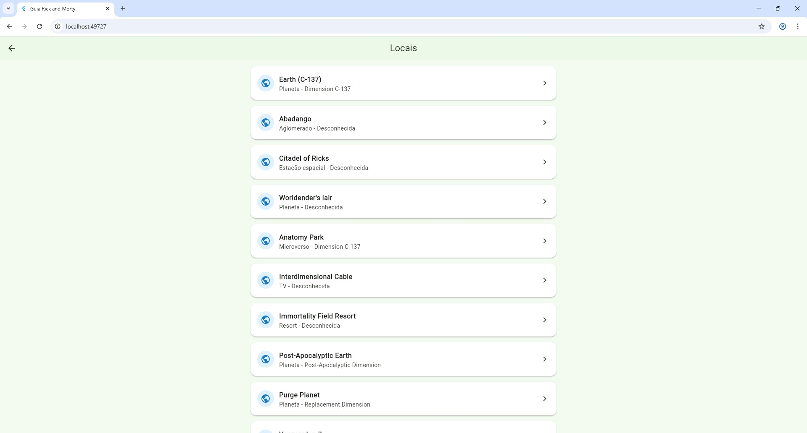
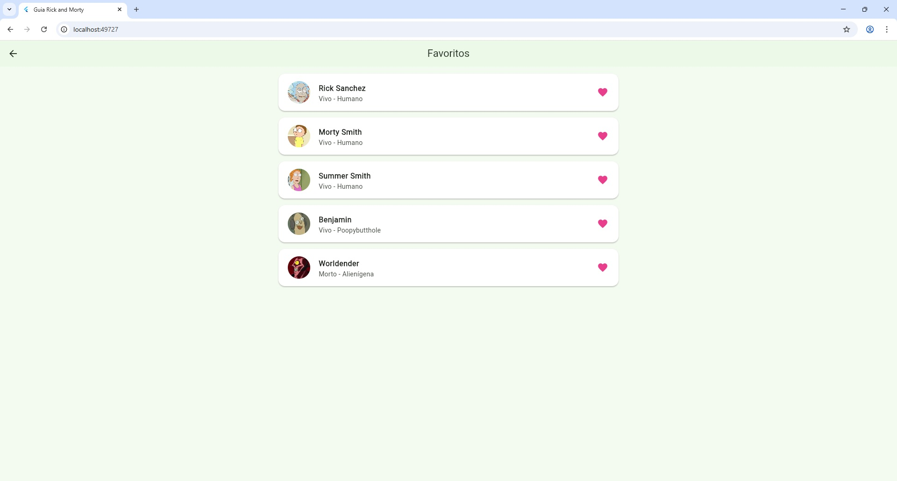

# Guia Rick and Morty

Aplicativo Flutter que consome a Rick and Morty API para listar personagens,
locais, residentes e gerenciar personagens favoritos com persistência local.

## Funcionalidades

- Tela inicial com nome do app, descrição e navegação para Personagens, Locais e Favoritos.
- Listagem paginada de personagens com carregamento progressivo ao rolar.
- Detalhes do personagem com imagem, nome, status, espécie, gênero, origem e localização atual.
- Modal de imagem com zoom na tela de detalhes.
- Adição e remoção de favoritos pela lista ou pela tela de detalhes.
- Persistência local de favoritos com `shared_preferences`.
- Listagem paginada de locais com nome, tipo e dimensão.
- Listagem dos residentes de um local com navegação para detalhes.
- Estados de loading, erro e vazio.
- Estado global com `Provider` e `ChangeNotifier`.

## Capturas de Tela

### Tela inicial



### Personagens



### Detalhes do personagem



### Locais



### Favoritos



## Bibliotecas

- `http`: requisições REST.
- `provider`: gerenciamento de estado.
- `shared_preferences`: persistência local.

## Como executar

```powershell
flutter pub get
flutter run
```

Neste computador, caso `flutter` não esteja no PATH, use:

```powershell
& "C:\Users\Marcus Vinícius\Desktop\Books Search com Open Library\flutter-sdk\bin\flutter.bat" pub get
& "C:\Users\Marcus Vinícius\Desktop\Books Search com Open Library\flutter-sdk\bin\flutter.bat" run
```

## Android

O arquivo `android/app/src/main/AndroidManifest.xml` já contém a permissão:

```xml
<uses-permission android:name="android.permission.INTERNET" />
```
